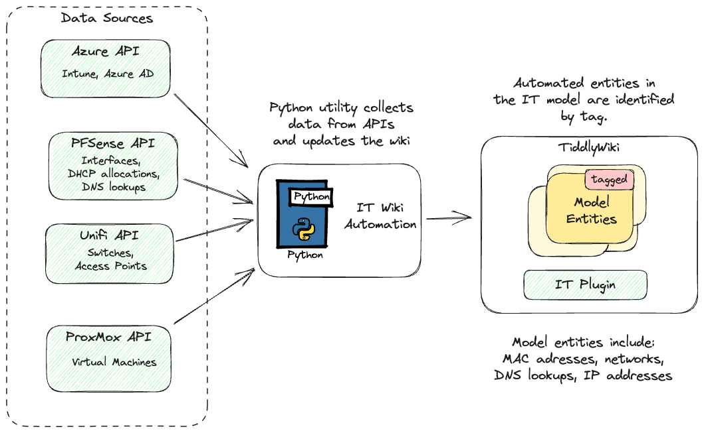

# IT Wiki Automation

A Python wiki which automates the creation and updating of network information in an IT wiki (as per https://github.com/Open-Security-Tools/it_tiddlywiki_plugin).

## Design

This python utility pulls information from various APIs, normalises the data and then pushes updates to an IT wiki. 

The automation has been limited to network topology items which are (1) a pain to maintain, and (2) do not overlap with wiki components which may contain manually entered information.
